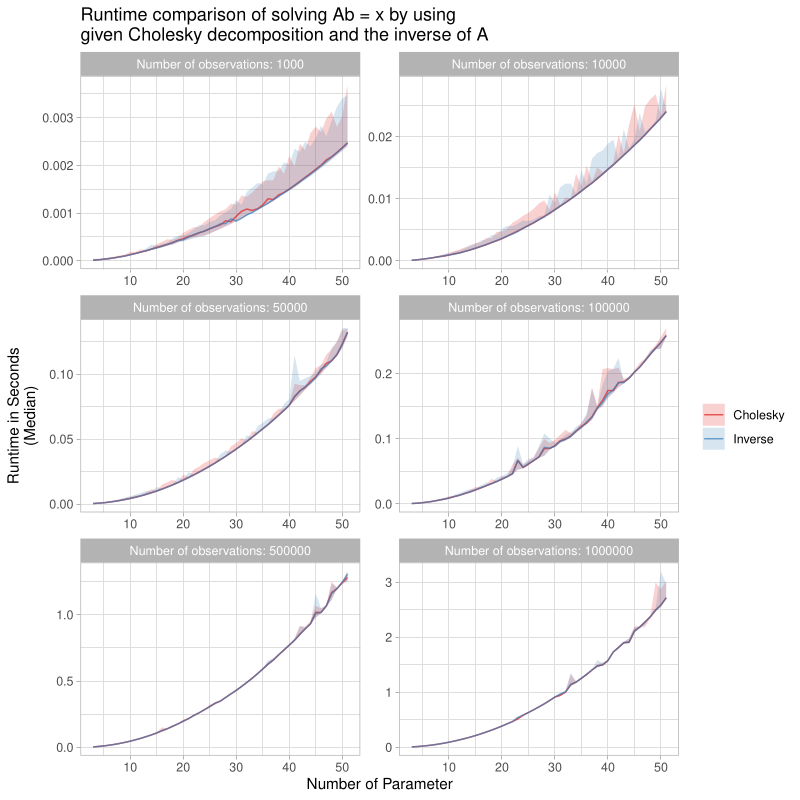

# Benchmark Collection

This repository contains small benchmarks. These benchmarks are mainly used to pre-test smaller code snippets before including them in [`compboost`](https://github.com/schalkdaniel/compboost). The collection contains:

### Fitting a linear model with given Cholesky decomposition vs. inverse matrix: `R/inverse_vs_cholesky.R`

Code: `R/inverse_vs_cholesky.R`

Since boosting is a sequential algorithm we start by initializing the base-learner and store (cache) all data that is reused during the fitting process. This also applies for the fitting of a linear model. Here, we store the inverse matrix or Cholesky decomposition to fast calculate the estimator in each iteration. This small benchmark was used to get an idea which of these two option works faster, if one works faster. The visualization of the results:

### Fitting a linear model to one categorical feature.

Code: `R/binary_ridge.R`

This is basically calculating the mean within groups.
